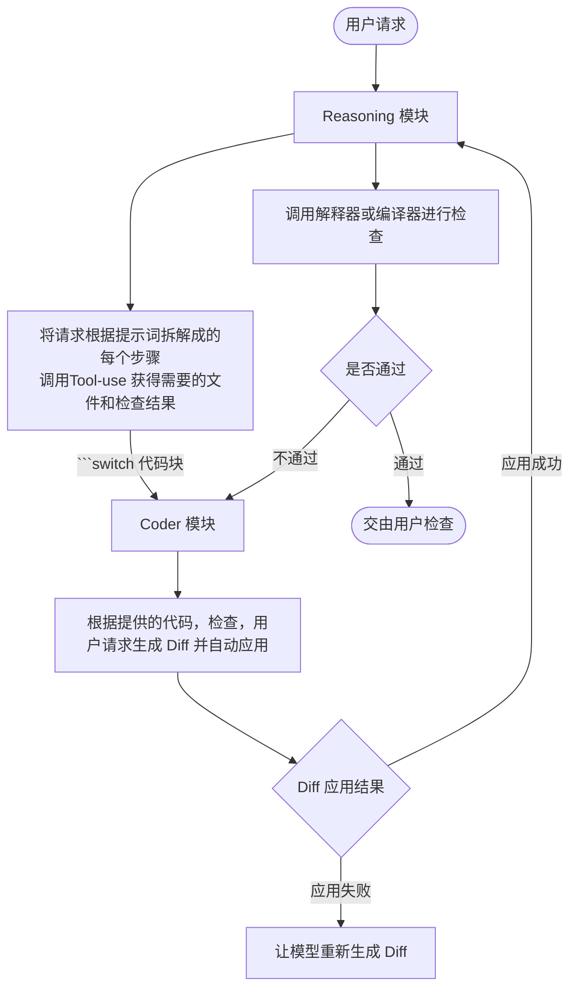

## 注意力分离（Attention Separation）设计思路

### 1. 思路来源
在 Oxicodent 早期测试中，模型容易在 **过长的上下文** 和 **不当的提示词** 中迷失自我，导致输出质量下降严重。
在一个 “真空” 环境下，只有 **用户请求** 和 **代码文件** 的情况下，模型却能够精准的找出问题所在，并给出完美的 Diff。

**如果能将 逻辑 分成**：

- Reasoning: 分解问题，处理工具调用，进行测试，总结错误
- Coder: 在 **干净的上下文** 下，进行专业的 **代码解析和生成**，并生成 Diff

这能够将两种专注不同方面的的需求进行解耦，两者只需要自己的任务是否成功。

### 2. 设计思路
在 代理应用 中维护两份提示词与上下文，分别用于 Tool-use 与 Coding

> 次设计以保证最纯净的 模块专用提示词 和 上下文，以生成高质量的内容