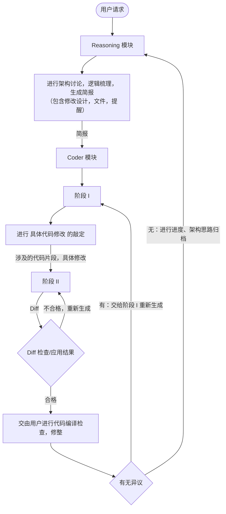

# M.A.G.I. 三贤人 — Oxicodent 上下文策略

> M.A.G.I. 的设计旨在 **保证阶段上下文干净**，将代码任务转化为 **多阶段**

## 0. Oxicodent 设计原则
- 以 **人为主导**，AI 辅助的路线，而非全自动 Agent，旨在降低最低模型适用参数量，让小模型也能做大项目

- 把 **人的思路架构规划** 为最高准则，让模型生成的代码变成 **思维的延伸**。

- 人进行 补丁应用后 的 **代码修整与验收**，旨在让人能在执行检查命令时，熟悉代码。而不是像 Agent 自己敲定方案，看着跟乱码一样，人无法维护

## 1. 三层分工

### 第一层：Reasoning（架构讨论）
- **定位**：首席架构师，用户的直接对话者。
- **职责**：
    - 把握项目大方向与逻辑演进。
    - 维护思维连贯性，管理全局进度。
    - 下达任务指令给下级模块。
- **上下文策略**：仅保留历史关键决策与当前架构大纲，隔离具体实现噪音。

### 第二层：Coder (代码生成)
- **定位**：高级程序员，专注局部代码实现。
- **职责**：
    - 在受控范围内生成代码补丁 (Diff)。
    - 与用户沟通代码层的微调建议。
- **上下文策略**：仅接收来自 Reasoning 的任务简报，相关代码片段 + Instruct 提供的技术简报。

### 第三层：Instruct (文档搜索与精简)
- **定位**：技术助理，处理高噪音、高延迟任务。
- **职责**：
    - 执行 Web Search (通过 SearXNG)。
    - 总结 长篇文档，提取核心代码契约。
- **上下文策略**：单次任务完成后销毁，仅向 Markdown 快照输出纯净事实。

## 2. *Reasoning：进度归档*
Reasoning 模块在和用户进行 **架构讨论完毕** 时 自动将
- 讨论结果
- 当前架构设计
- 项目进度

写入 `oxicodent-assistant.md` 归档，方便下一次启动时让 Assistant 快速回归状态

## 3. *Coder：C.D.S.P 协定*
**核心哲学：**
将代码修改拆分为 **“逻辑决策”** 与 **“物理实施”**。通过清空上下文后的二次启动，彻底消除 AI 在长对话中的注意力漂移与代码异化。
---

### 阶段 I：评估与规划 (Evaluator/Planner)
**目标**：理解全局，生成修改方案，而非写出代码。

- **输入要素**：
  - `Goal`: 修改意图与架构约束。
  - **广域上下文**：Reasoning 模块的简报、相关联的多个文件片段、API 文档。
- **任务重点**：
  - **依赖分析**：识别改动是否破坏现有的 Trait、生命周期或调用链。
  - **复用审计**：强制检索项目中已有的工具函数，严禁重复造轮子。
  - **改动锚定**：精准锁定需要修改的行号区间。
- **产出**：一份结构化的 **Implementation Spec**（实施规格书）。
- **上下文状态**：依旧保留，方便用户要求返工。

---

### 阶段 II：生成与缝合 (Generator/Surgeon)
**目标**：在“真空环境”下执行精准的代码切割与替换。

- **注入逻辑**：上下文只包含 实施规格书。
- **输入要素**：
  - **最小上下文**：仅提供阶段 I 确定的目标文件片段。
  - **行动指令**：阶段 I 产出的 Implementation Spec。
- **原子修改**：仅针对指定行号进行 Diff 生成。
- **约束**：禁止任何逻辑发散，不准添加指令之外的“健壮性”代码。
- **上下文状态**：在 补丁应用 后清空。

---

## 4. 可视化流程

